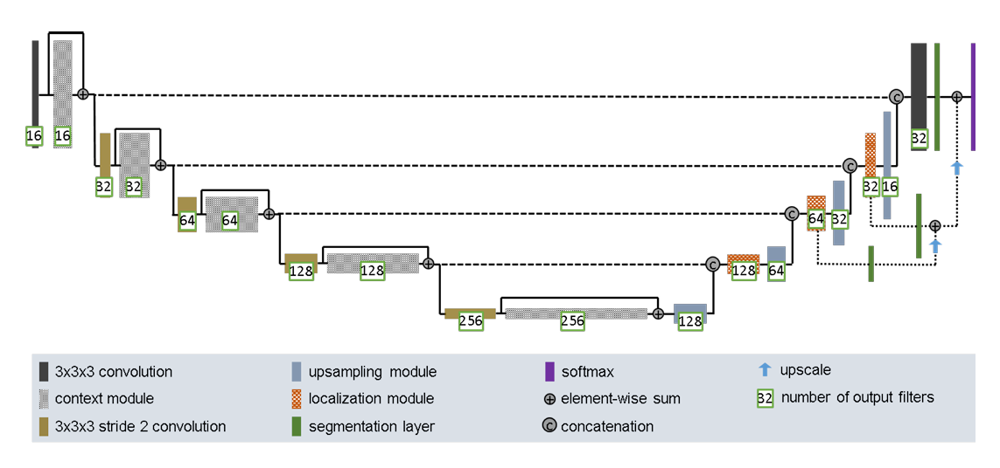
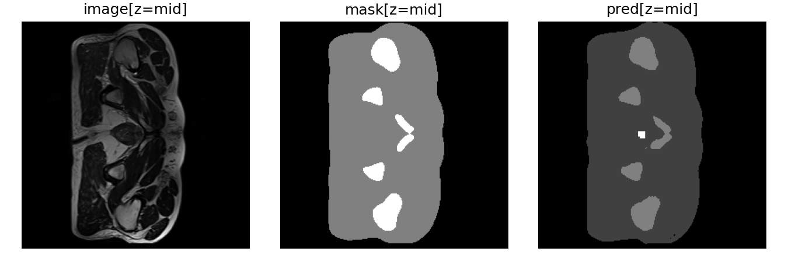
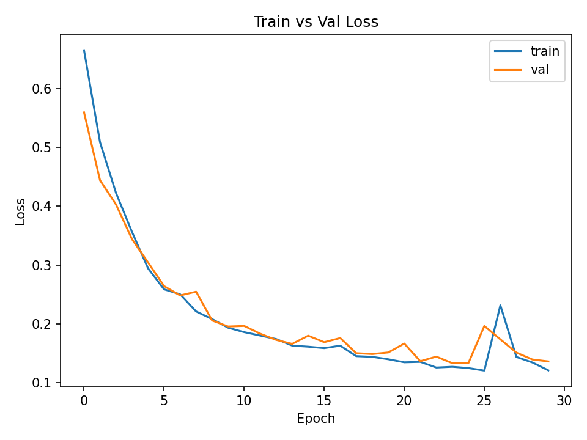
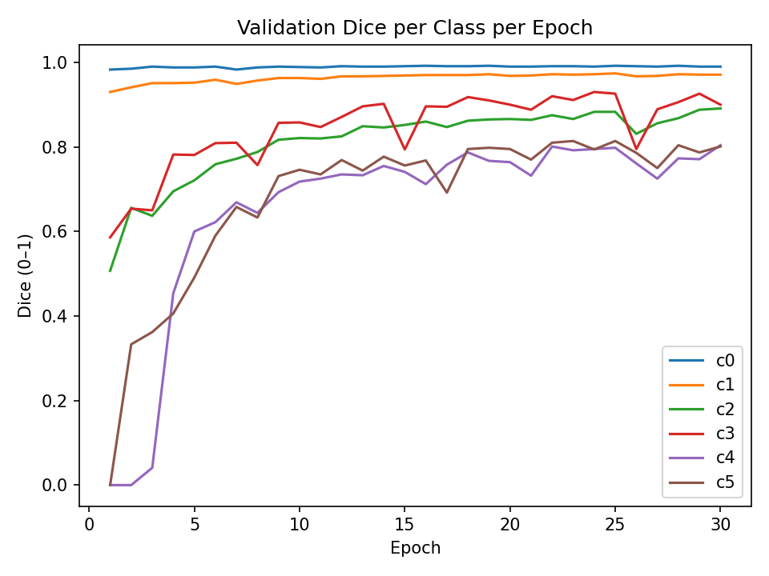

# COMP3710 — Project 7: Improved UNet3D for Prostate MRI Segmentation
> **Result highlight:** All six labels achieve Dice >= 0.70 on the test set. \
> **Current run:** min per class Dice = 0.8255 (test).

 **Author:**  Roman Bek (48092360)

___

## Scope 
This repository implements only the 3D solution for Project 7 (Improved UNet3D). Previously explored a 2D UNet as a warm up, but per course guidance only 3D materials are included here and the 2D work is mentioned for context only and not part of the submission however, it can be viewed in the commit history.

___

## Problem and Goal
**Task:** Segment downsampled 3D prostate MRI volumes into semantic classes (background + 5 organs), meeting the project requirement that all labels achieve Dice >= 0.70 on the test set.

**Dataset format:** NIfTI volumes (.nii.gz) with matching image/label stems.

___

## Method
The implementation follows the [Isensee 3D U-Net](https://arxiv.org/abs/1802.10508v1) design and [nnU-Net](https://arxiv.org/abs/1809.10486) conventions: the encoder stacks pre activation residual context blocks (InstanceNorm3d; LeakyReLU 0.01; 3x3x3 conv; Dropout3d; InstanceNorm3d; LeakyReLU 0.01 and then 3x3x3 conv). With a 1x1x1 skip when channels change linked by 3x3x3 stride-2 convolutions for learnable downsampling. The decoder uses nearest neighbor x2 upsampling followed by a 3x3x3 conv to avoid checkerboard artifacts, concatenates the aligned skip and applies a light localisation block (3x3x3 then 1x1x1). Deep supervision is added by summing two auxiliary 1x1x1 heads into the final logits, and use InstanceNorm3d and LeakyReLU(0.01) as in nnU-Net. The loss is weighted cross entropy plus soft Dice so background is down weighted and classes 4 + 5 (rectum/prostate) are up weighted to handle class imbalance (*Figure 1*). The current implementation does however have differences to the referenced setup. A narrower width (base=16 rather than 32/64) to fit VRAM and speed full volume training, a simple training recipe (z-score per volume, axis flips only, manual class weights) instead of nnU-Net's full auto-pipeline for clarity, and AdamW with summed deep-supervision heads for stable convergence and stronger small-organ Dice. Finally, the minimum per-class Dice are reported to match the project goal that all labels achieve >= 0.70.

*Figure 1. Network architecture ([Isensee](https://arxiv.org/abs/1802.10508v1))*

___

## Model Details
* Improved UNet3D ([Isensee](https://arxiv.org/abs/1802.10508v1) style)
* Classes: NUM_CLASSES = 6 (mapping: 0=Background, 1=Body, 2=Bone, 3=Bladder, 4=Rectum, 5=Prostate)
* Deep supervision: two aux heads summed into the final logits
* Normalisation: InstanceNorm3d
* Activations: LeakyReLU(0.01)
* Regularisation: light Dropout3d in context blocks

___

## Data and Preprocessing
### Transforms
* Z-score normalization per volume (images only)
    - Standardizes intensity scale per scan so the network doesn't chase absolute MR intensity
* Augmentation (train only): random flips on each axis (p = 0.5 per axis).
    - Pelvic structures are about symmetric so flips expand data diversity cheaply and reduce overfitting
* Tensor shapes: images to [1, D, H, W], labels to [1, D, H, W] (long, class ids). Where, 1: channels (grayscale); D: depth; H: height; W: width
* Batching: zero-pad each sample to batch maxima in D/H/W.

___

## Split and reproducibility
* Deterministic 80/10/10 train/val/test via a fixed generator seed (67). This maximizes training data while retaining a non tiny validation set for stable model selection.
* 80% maximizes learning signal and 10% val is large enough for stable model selection and fixed seed makes runs comparable
**No data leackage:** Train/val/test are disjoint (fixed seed 67), no validation or test volumes are used in training at any time.

## Training Setup
* Loss: CrossEntropy(weight=class_weights) + 0.5 * soft_dice_loss(logits, y)
* Class weights: [0.05, 1.0, 1.0, 1.0, 2.0, 2.0] (down weight background, emphasize small organs)
* Optimizer: AdamW(lr = 5e-4)
* Precision: Mixed precision (torch.amp) enabled when CUDA is available
* Schedule: epochs = 30, batch_size = 1 (3D memory constraints)
* Metrics: per-class Dice on val each epoch; min per-class Dice shown as a conservative summary; test reported at end

**Justification:** Batch size = 1 to fit full 3D volumes in VRAM while remaining stable with InstanceNorm3d; 30 epochs because val loss/Dice could plateau around 25–30 and already meet the >= 0.7 per class target; LR = 5e-4 (AdamW) as a stable mid range choice (between 1e-4 and 1e-3) that converges reliably with deep supervision under AMP.

___

## Environment and Dependencies
### Dependencies
* Python 3.10.6
* PyTorch >= 2.1
* NumPy 1.26.4
* NiBabel >= 5.3
* Matplotlib >= 3.9
* (TorchVision for transforms wrapper)

### Hardware and runtime (original run)
* OS: Windows (paths like C:\Users...)
* Epochs: 30, batch size: 1
* Total time: ~ 10,953.7 s (~ 3 h 02 m)
* Device is selected automatically: CUDA if available, otherwise CPU

___

## Usage
### 1) Place data
**Put 3D data under:**
- recognition/improved_unet3d_48092360/data/3d_dataset/semantic_MRs/
- recognition/improved_unet3d_48092360/data/3d_dataset/semantic_labels_only/
(OR change DATA_ROOT_3D variable path to data in train.py and predict.py)

### 2) Train
**Run:**
- python recognition/improved_unet3d_48092360/train.py

**Artifacts are saved in:**
- recognition/improved_unet3d_48092360/outputs/best.pt          (best by validation loss)
- recognition/improved_unet3d_48092360/outputs/loss_curve.png
- recognition/improved_unet3d_48092360/outputs/dice_curve.png

### 3) Predict (single volume)
**Run:**
- python recognition/improved_unet3d_48092360/predict.py

**Outputs:**
- Console: per class Dice for a held out example
- recognition/improved_unet3d_48092360/outputs/predict_example_3d.png    (central axial slice (image, GT, pred))

___

## Results and Segmentation
### Validation (during training)
Loss and "min perclass Dice" per epoch are printed; the two plots are saved automatically to recognition/improved_unet3d_48092360/outputs

### Test set (final)
**30 epoch run, final console out:**
TEST: loss **0.0622** | min dice **0.8255**
TEST: dice per class: c0:**0.989** c1:**0.972** c2:**0.897** c3:**0.902** c4:**0.826** c5:**0.836**

where c0: Background, c1: Body, c2: Bone, c3: Bladder, c4: Rectum, c5: Prostate

*Figure 2. Central axial slice from volume 0: input MRI (left), ground truth labels (middle) and UNet3D prediction (right)*

**Results Analysis:**
On the held out test set the model achieves minimum per-class Dice = 0.8255, clearing the >=0.70 target for all six labels. Per class Dice: Background 0.989, Body 0.972, Bone 0.897, Bladder 0.902, Rectum 0.826, Prostate 0.836. Importantly, the small and harder organs (rectum, prostate) both pass 0.82, showing good boundary capture with little spill into neighbours. The central slice in *Figure 2* closely matches the ground truth most differences are at thin edges backing up the steady drop in validation loss and the strong final scores.

___

## Plot of Loss and Plot of Dice

*Figure 3. Train vs validation loss across epochs*

**Loss Analysis:**
Training and validation loss both drop fast at the start, then keep trending down with a few small oscillations. The gap between train and val stays narrow which indicates low overfitting and good generalisation. Some bumps are expected with class balanced sampling and augmentation since they follow brief drops in Dice but recover as the optimiser settles. By the final epochs, validation loss stabilises at a low level, consistent with the strong test Dice.

---

*Figure 4. Validation Dice per class per epoch*

**Dice Analysis:**
Large classes—c0 (Background) and c1 (Body) reach high dice early because they cover most voxels and are easy to learn. Mid sized structures—c2 (Bone) and c3 (Bladder) improve steadily as deeper features and skip connections refine boundaries. Small/rare organs c4 (Rectum) and c5 (Prostate) start low due to poor class imbalance, because of thin shapes but improve across epochs as class weighted CE and deep supervision reinforce them. By the end, all classes converge to strong Dice.

___

## References
Çiçek, Özgün, et al. “3D U-Net: Learning Dense Volumetric Segmentation from Sparse Annotation.” arXiv:1606.06650, arXiv, 21 Jun. 2016. arXiv.org, https://doi.org/10.48550/arXiv.1606.06650.

CSIRO Data Access Portal. https://data.csiro.au/collection/csiro:51392v2. Accessed 25 Oct. 2025.

Isensee, Fabian, et al. “nnU-Net: Self-Adapting Framework for U-Net-Based Medical Image Segmentation.” arXiv:1809.10486, arXiv, 27 Sep. 2018. arXiv.org, https://doi.org/10.48550/arXiv.1809.10486.

Torch.Nn.Functional.Interpolate — PyTorch 2.9 Documentation. https://docs.pytorch.org/docs/stable/generated/torch.nn.functional.interpolate.html. Accessed 25 Oct. 2025.

Torch.Utils.Data — PyTorch 2.9 Documentation. https://docs.pytorch.org/docs/stable/data.html. Accessed 26 Oct. 2025.
